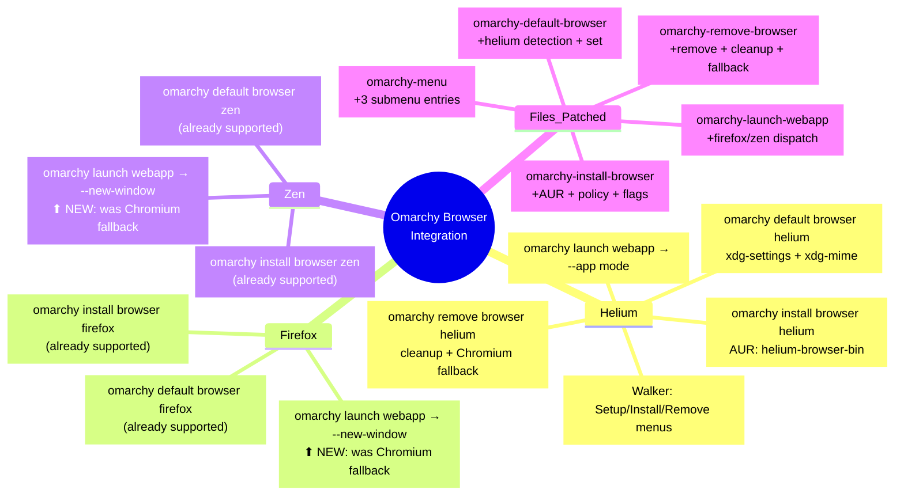

## Architecture

```
┌─────────────────────────────────────────────────────────┐
│                     omarchy-default-browser              │
│  detect ──→ xdg-settings set ──→ xdg-mime ──→ notify   │
│  helium.desktop    default-web-browser  http/https/html  │
└─────────────────────────────────────────────────────────┘

┌─────────────────────────────────────────────────────────┐
│                     omarchy-install-browser              │
│  helium-browser-bin (AUR)                                │
│    ├── /etc/helium/policies/managed/                     │
│    └── ~/.config/helium-flags.conf                       │
└─────────────────────────────────────────────────────────┘

┌─────────────────────────────────────────────────────────┐
│                     omarchy-remove-browser               │
│  omarchy-pkg-drop helium-browser-bin                     │
│    ├── rm ~/.config/helium-flags.conf                    │
│    ├── sudo rm /etc/helium/policies/managed/color.json   │
│    └── fallback → chromium if was default                │
└─────────────────────────────────────────────────────────┘

┌─────────────────────────────────────────────────────────┐
│                     omarchy-launch-webapp                │
│  ┌──────────┐  ┌──────────────┐  ┌───────────────────┐  │
│  │ chromium │─→│ --app "$url" │─→│ uwsm-app exec     │  │
│  │ helium   │─→│ --app "$url" │─→│ uwsm-app exec     │  │
│  │ firefox  │─→│ --new-window │─→│ uwsm-app exec     │  │
│  │ zen      │─→│ --new-window │─→│ uwsm-app exec     │  │
│  │ other    │─→│ chromium     │─→│ uwsm-app exec     │  │
│  └──────────┘  └──────────────┘  └───────────────────┘  │
└─────────────────────────────────────────────────────────┘

## Walker Menu Flow

```
SUPER+Space
├── Setup
│   └── Defaults
│       └── Browser
│           ├── Chromium ◄── default
│           ├── Chrome
│           ├── Brave
│           ├── Brave Origin
│           ├── Edge
│           ├── Firefox
│           ├── Zen
│           └── Helium   ◄── NEW
├── Install
│   └── Browser
│       └── Helium       ◄── NEW
└── Remove
    └── Browser
        └── Helium       ◄── NEW
```

## Install / Restore Flow

```
install.sh:
  Download 5 files from GitHub
  Backup originals → {file}.bak.{timestamp}
  Copy patched files → ~/.local/share/omarchy/bin/
  Message: "Done! omarchy restart walker"

restore.sh:
  Find latest .bak for each file
  Copy .bak back → ~/.local/share/omarchy/bin/{file}
  Remove .bak files
  Message: "Done! omarchy restart walker"
```
