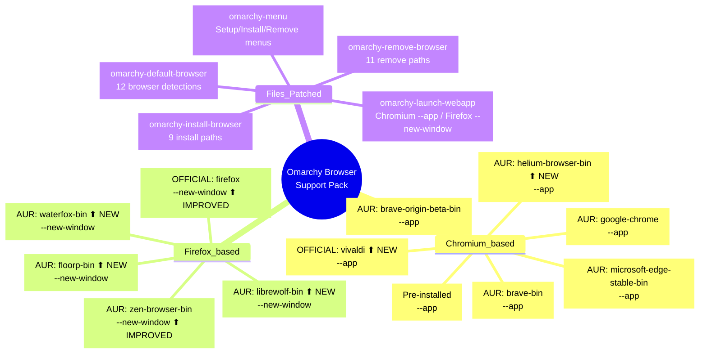

## Architecture

```
┌──────────────────────────────────────────────────────────┐
│  omarchy-default-browser                                 │
│  ┌──────────────┐  ┌────────────────┐  ┌─────────────┐  │
│  │ 12 browsers  │─→│ xdg-settings   │─→│ notify-send │  │
│  │ detected via │  │ xdg-mime       │  │ "X is now   │  │
│  │ desktop file │  │ (http/https/   │  │  default"   │  │
│  │              │  │  text/html)    │  │             │  │
│  └──────────────┘  └────────────────┘  └─────────────┘  │
└──────────────────────────────────────────────────────────┘

┌──────────────────────────────────────────────────────────┐
│  omarchy-launch-webapp                                   │
│                                                          │
│  chromium/*/helium* ──→ --app "$url" ──→ uwsm-app exec   │
│  firefox/zen/floorp/waterfox/librewolf ──→ --new-window  │
│  anything else ──→ chromium --app (fallback)              │
└──────────────────────────────────────────────────────────┘

## Walker Menu

```
SUPER+Space
├── Setup → Defaults → Browser
│   ├── Chromium ◄── default
│   ├── Chrome / Brave / Brave Origin / Edge
│   ├── Vivaldi ◄── NEW
│   ├── Firefox / Zen / Helium
│   ├── Floorp / Waterfox ◄── NEW
│   └── LibreWolf ◄── NEW
├── Install → Browser
│   └── (all 12 browsers listed)
└── Remove → Browser
│   └── (all 12 browsers listed)
```

## Restore Flow

```
restore.sh:
  cd ~/.local/share/omarchy
  git checkout -- bin/omarchy-*
  # No backups needed — git always has originals
```
