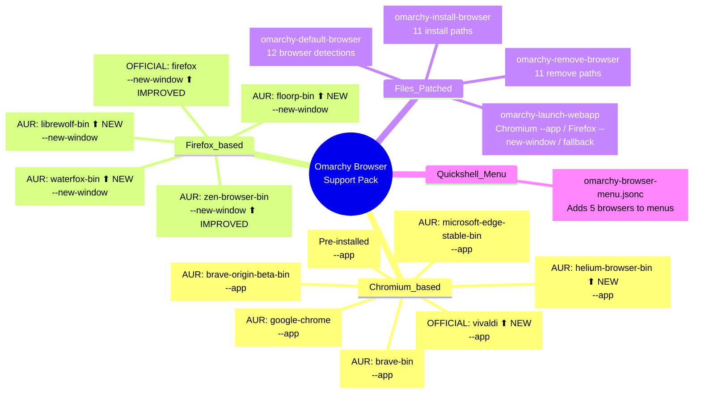

```mermaid
mindmap
  root((Omarchy Browser<br/>Support Pack))
    Chromium_based
      Chromium["Pre-installed<br/>--app"]
      Chrome["AUR: google-chrome<br/>--app"]
      Brave["AUR: brave-bin<br/>--app"]
      Brave_Origin["AUR: brave-origin-beta-bin<br/>--app"]
      Edge["AUR: microsoft-edge-stable-bin<br/>--app"]
      Vivaldi["OFFICIAL: vivaldi ⬆ NEW<br/>--app"]
      Helium["AUR: helium-browser-bin ⬆ NEW<br/>--app"]
    Firefox_based
      Firefox["OFFICIAL: firefox<br/>--new-window ⬆ IMPROVED"]
      Zen["AUR: zen-browser-bin<br/>--new-window ⬆ IMPROVED"]
      Floorp["AUR: floorp-bin ⬆ NEW<br/>--new-window"]
      Waterfox["AUR: waterfox-bin ⬆ NEW<br/>--new-window"]
      LibreWolf["AUR: librewolf-bin ⬆ NEW<br/>--new-window"]
    Files_Patched
      default_browser["omarchy-default-browser<br/>12 browser detections"]
      install_browser["omarchy-install-browser<br/>11 install paths"]
      remove_browser["omarchy-remove-browser<br/>11 remove paths"]
      webapp["omarchy-launch-webapp<br/>Chromium --app / Firefox --new-window / fallback"]
    Quickshell_Menu
      jsonc["omarchy-browser-menu.jsonc<br/>Adds 5 browsers to menus"]
```

## Architecture

```
┌──────────────────────────────────────────────────────────┐
│  omarchy-default-browser                                 │
│  ┌──────────────┐  ┌────────────────┐  ┌─────────────┐  │
│  │ 12 browsers  │─→│ xdg-settings   │─→│ notify-send │  │
│  │ detected via │  │ xdg-mime       │  │ "X is now   │  │
│  │ desktop file │  │ (http/https/   │  │  default"   │  │
│  │              │  │  text/html)    │  │             │  │
│  └──────────────┘  └────────────────┘  └─────────────┘  │
└──────────────────────────────────────────────────────────┘

┌──────────────────────────────────────────────────────────┐
│  omarchy-launch-webapp                                   │
│                                                          │
│  chromium/*/helium* ──→ --app "$url" ──→ uwsm-app exec   │
│  firefox/zen/floorp/waterfox/librewolf ──→ --new-window  │
│  anything else ──→ chromium --app (fallback)              │
└──────────────────────────────────────────────────────────┘

┌──────────────────────────────────────────────────────────┐
│  Quickshell Menu Extension                               │
│                                                          │
│  omarchy-browser-menu.jsonc ──→ Dotted IDs               │
│  ├── setup.default.browser.vivaldi/helium/floorp/...     │
│  ├── install.browser.vivaldi/helium/floorp/...           │
│  └── remove.browser.vivaldi/helium/floorp/...            │
└──────────────────────────────────────────────────────────┘
```

## Shell Menu

```
SUPER+Space
├── Setup → Defaults → Browser
│   ├── Chromium ◄── default
│   ├── Chrome / Brave / Brave Origin / Edge
│   ├── Vivaldi / Helium ◄── NEW
│   ├── Firefox / Zen
│   ├── Floorp / Waterfox ◄── NEW
│   └── LibreWolf ◄── NEW
├── Install → Browser
│   └── (all 12 browsers listed)
└── Remove → Browser
│   └── (all 12 browsers listed)
```

## Restore Flow

```
restore.sh:
  1. Restore scripts from /usr/share/omarchy/bin/ or git repo
  2. Remove omarchy-browser-menu.jsonc from ~/.config/omarchy/extensions/
  3. Remove provider scripts from ~/.config/omarchy/providers/
  4. Clean up .bak files
```
