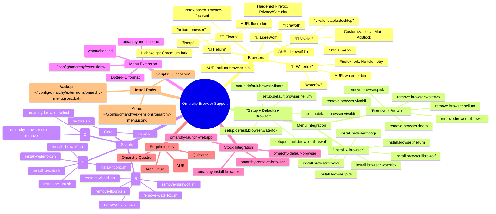

# Omarchy Browser Support Pack — Mind Map

```mermaid
mindmap
  root((Omarchy Browser Support))
    Browsers
      "󰀙 Vivaldi"
        Official Repo
        "vivaldi-stable.desktop"
        Customizable UI, Mail, AdBlock
      "󰀘 Helium"
        AUR: helium-browser-bin
        "helium-browser"
        Lightweight Chromium fork
      "󰈹 Floorp"
        AUR: floorp-bin
        "floorp"
        Firefox-based, Privacy-focused
      "󰈹 Waterfox"
        AUR: waterfox-bin
        "waterfox"
        Firefox fork, No telemetry
      "󰈹 LibreWolf"
        AUR: librewolf-bin
        "librewolf"
        Hardened Firefox, Privacy/Security
    Menu Integration
      "Setup ▸ Defaults ▸ Browser"
        setup.default.browser.vivaldi
        setup.default.browser.helium
        setup.default.browser.floorp
        setup.default.browser.waterfox
        setup.default.browser.librewolf
      "Install ▸ Browser"
        install.browser.vivaldi
        install.browser.helium
        install.browser.floorp
        install.browser.waterfox
        install.browser.librewolf
        install.browser.pick
      "Remove ▸ Browser"
        remove.browser.vivaldi
        remove.browser.helium
        remove.browser.floorp
        remove.browser.waterfox
        remove.browser.librewolf
        remove.browser.pick
    Scripts
      Core
        install.sh
        restore.sh
      Installers (5)
        install-helium.sh
        install-vivaldi.sh
        install-floorp.sh
        install-waterfox.sh
        install-librewolf.sh
      Removers (5)
        remove-helium.sh
        remove-vivaldi.sh
        remove-floorp.sh
        remove-waterfox.sh
        remove-librewolf.sh
      Helpers (2)
        omarchy-browser-select
        omarchy-browser-select-remove
    Menu Extension
      omarchy-menu.jsonc
      ~/.config/omarchy/extensions/
      Dotted-ID format
      Smart visibility (when/checked)
    Stock Integration
      omarchy-default-browser
      omarchy-install-browser
      omarchy-remove-browser
      omarchy-launch-webapp
    Requirements
      Omarchy Quattro
      Arch Linux
      yay/paru (AUR)
      Quickshell
    Install Paths
      Menu: ~/.config/omarchy/extensions/omarchy-menu.jsonc
      Scripts: ~/.local/bin/
      Backups: ~/.config/omarchy/extensions/omarchy-menu.jsonc.bak.*
```